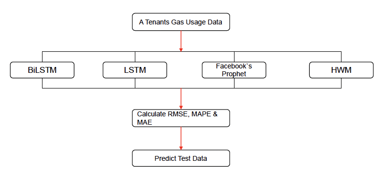

# Machine Learning and Forecasting Approaches for Predicting Natural Gas Consumption
Rahmatov, N., Kwon, J., Bae, J., Seo, K., Jeon, H., Jeon, J., Jo, E., & Baek, H. (2024). Machine learning and forecasting approaches for predicting natural gas consumption. In *2024 15th International Conference on Information and Communication Technology Convergence (ICTC)* (pp. 2021–2026). IEEE. https://doi.org/10.1109/ICTC62082.2024.10826851

## Summary

This paper compares four forecasting models for predicting natural gas consumption and cost for a single tenant of Daesung Group, a South Korean energy company. Using 6+ years of monthly billing data (March 2018 – June 2024) and meteorological factors, the study predicts both volumetric consumption (cubic meters) and gas bill cost (KRW) for April–July 2024. BiLSTM came out on top, with Facebook's Prophet close behind.

## Research questions

- Which forecasting model most accurately predicts natural gas consumption and cost for a single tenant?
- How do ML-based models (BiLSTM, LSTM) compare to statistical forecasting methods (Facebook's Prophet, Holt-Winters)?

## Contributions

- Comparative evaluation of four forecasting models on real-world gas usage data from a single tenant
- Shows that BiLSTM beats both classical and other ML-based models on this task
- Runs all four models in parallel to make comparison direct and fair

## Methodology

- **Data:** Monthly gas usage data from one tenant at Daesung Group (March 2018 – June 2024); meteorological factors used as predictors
- **Models:** BiLSTM, LSTM, Facebook's Prophet, Holt-Winters Method (HWM)
- **Targets:** Gas consumption (m³) and gas bill cost (KRW)
- **Forecast time:** April 2024 – July 2024
- **Evaluation metrics:** RMSE, MAPE, MAE
- **Tools:** Python, Pandas, NumPy, Matplotlib

## Results

| Model | RMSE | MAPE | MAE |
|-------|------|------|-----|
| BiLSTM | 19,651 | -166.61 | -42,173 |
| LSTM | 59,831 | -11.15 | 11,500 |
| FB's Prophet | 20,914 | -62.96 | -11,772 |
| HWM | 47,346 | 11,606 | 54,457 |

BiLSTM had the lowest RMSE. Prophet was second. But LSTM actually did worse than HWM, surprising for a model that's supposed to handle long-term dependencies.

## Limitations

- BiLSTM and LSTM outputs vary between training runs; tuning the learning rate is necessary but time-consuming
- LSTM suffers from gradient vanishing, which hurts long-sequence performance
- HWM can only model linear trends and gives no uncertainty estimates
- Facebook's Prophet is deterministic (single output, no covariance support)
- Only one tenant's data, so it's unclear how well any of this generalizes

## Conclusions

BiLSTM works best here, mainly because processing sequences in both directions gives it more context per prediction. The authors say that combining ML and classical methods is a strength, though in practice they evaluated the models separately and only compared outputs. Future work is left vague, "more advanced hybrid models" without much specifics.

## Relevance to thesis

Maybe useful as background on why ML beats classical methods in gas forecasting, and as a source for the RMSE/MAE/MAPE evaluation framework.
