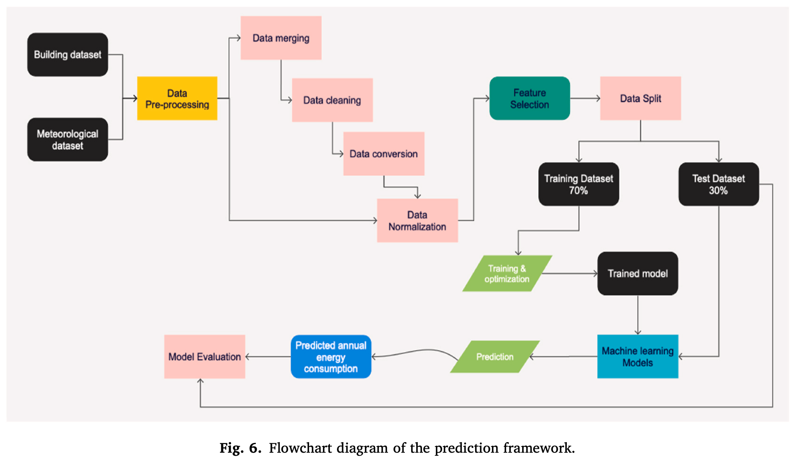
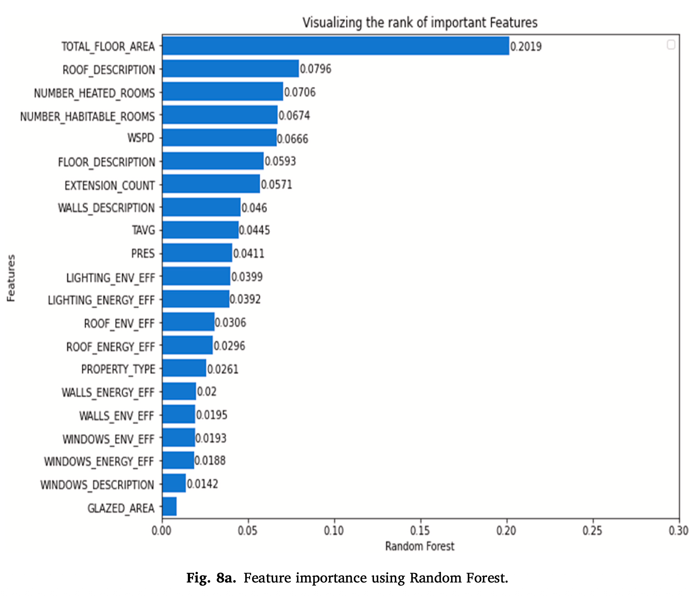

# Building energy consumption prediction for residential buildings using deep learning and other machine learning techniques
Olu-Ajayi, R., Alaka, H., Sulaimon, I., Sunmola, F., & Ajayi, S. (2022). Building energy consumption prediction for residential buildings using deep learning and other machine learning techniques. *Journal of Building Engineering*, 45, 103406.

## Summary

This paper compares nine ML algorithms for predicting annual energy consumption of residential buildings. The dataset covers 5000 buildings across ten UK postcodes, combining building metadata with meteorological data. DNN came out on top. Stacking and Linear Regression were at the bottom.

## Research questions

- Which machine learning algorithms perform best for predicting annual building energy consumption?
- What building and meteorological features are most predictive of energy consumption?
- How does dataset size affect model performance?

## Contributions

- Comparison of nine ML algorithms on the same dataset, so results are directly comparable across models.
- A prediction framework where designers enter key building features at the design stage and get an annual energy estimate before construction starts.
- Testing whether building clusters (property type) and dataset size affect model performance.

## Methodology

- **Data:** 5000 residential buildings in 10 UK postcodes; building metadata from the Ministry of Housing Communities and Local Government (MHCLG) combined with meteorological data from Meteosat (temperature, wind speed, pressure); target variable is annual energy consumption (kWh/m²) for the year 2020.
- **Preprocessing:** Data merging by postcode, missing value imputation (mean), removal of 540 instances with missing building data, min-max normalization; final dataset: 285,000 data points.
- **Feature selection:** Random Forest and Extra Trees classifier used to rank feature importance; top 10 features selected: total floor area, roof description, number of heated/habitable rooms, wind speed, floor description, extension count, walls description, temperature, and pressure.
- **Models:** DNN, ANN, Gradient Boosting (GB), Random Forest (RF), SVM, KNN, Decision Tree (DT), Linear Regression (LR), Stacking.
- **Split:** 70% training / 30% testing.
- **Evaluation metrics:** R², MAE, RMSE, MSE.

## Results

| Model | R² | MAE | RMSE | MSE |
|---|---|---|---|---|
| Deep Neural Network | 0.95 | 0.92 | 1.16 | 1.34 |
| Artificial Neural Network | 0.94 | 1.20 | 1.45 | - |
| Gradient Boosting | 0.92 | 1.10 | 1.40 | 1.95 |
| Support Vector Machines | 0.90 | 1.22 | 1.61 | 2.61 |
| Random Forest | 0.89 | 1.32 | 1.69 | 2.85 |
| K Nearest Neighbors | 0.77 | 1.90 | 2.40 | 5.78 |
| Decision Tree | 0.74 | 1.99 | 2.55 | 6.48 |
| Linear Regression | 0.73 | 2.02 | 2.59 | 6.72 |
| Stacking | 0.73 | 2.04 | 2.60 | 6.76 |

DNN was the best performer by a clear margin. Larger datasets helped DNN and ANN more than the simpler models. And building type had no real effect on which features ranked highest.

## Limitations

- Dataset is limited to 10 UK postcodes, which may not be representative of all residential areas.
- The study focuses only on annual energy consumption, not gas specifically.
- Meteorological data was averaged monthly, not daily, which may reduce predictive granularity.
- The study is based on UK buildings and UK climate.

## Conclusions

DNN is the most accurate model, edging out ANN and GB. Total floor area is the dominant feature by a wide margin, with roof description and number of rooms also ranking high. Wind speed ranks surprisingly high for a meteorological variable. Bigger datasets help the deep learning models more than the simpler ones, which is worth keeping in mind when working with limited data.

## Relevance to thesis

Good reference for model selection. GB and RF come close to DNN and ANN at much lower training cost, which supports using tree-based models in the thesis. The top features (floor area, building structure, weather variables) are all things we can get at the Dutch municipal level via CBS/BAG and KNMI.
