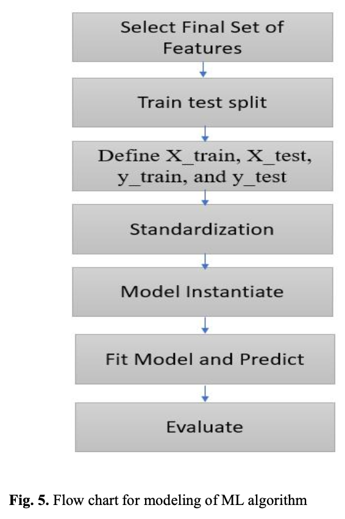

# Prediction and Analysis of Household Energy Consumption by Machine Learning Algorithms in Energy Management
Rambabu, M., Ramakrishna, N. S. S., & Polamarasetty, P. K. (2022). Prediction and analysis of household energy consumption by machine learning algorithms in energy management. *E3S Web of Conferences*, 350, 02002. https://doi.org/10.1051/e3sconf/202235002002

## Summary

This paper tests several machine learning regression models on short-term household appliance energy consumption. Data came from a single Belgian home monitored over 4.5 months, with ZigBee sensors recording indoor/outdoor temperature and humidity every 10 minutes. Tree-based models beat linear ones by a wide margin —> but only after feature engineering. Without it, even the best raw features had almost no correlation with energy use.

## Research questions

- Which machine learning algorithms best predict household energy consumption?
- How much does feature engineering improve model performance compared to raw data?
- What features are most important for energy consumption prediction?

## Contributions

- Demonstrates the value of feature engineering when raw features have low linear correlation with the target variable (Pearson correlations of -0.09 to 0.02 improved to -0.21 to 0.55 after engineering).
- Provides a clear comparison of seven algorithms across three experimental settings: baseline (raw data), after feature engineering, and after hyperparameter tuning.
- Identifies time-of-day as a critical feature for household energy prediction.

## Methodology

- **Dataset:** 4.5 months of 10-minute interval sensor readings from a single home in Belgium. Features include indoor temperatures and humidity per room, outdoor weather variables, and timestamps.
- **Preprocessing:** Log10 transformation of the target variable to handle skewed distribution; standardization of features.
- **Feature engineering:** Derived 13 additional features including average house temperature/humidity, temperature-humidity interaction terms per room (multiplied), and time-of-day classification into three session classes (10 PM–6 AM, 6 AM–3 PM, 3 PM–10 PM).
- **Train/test split:** 80/20.
- **Models:** Lasso, Linear Regression, Ridge, K-Neighbors, Random Forest, Extra Trees Regressor, Gradient Boosting, XGBoost.
- **Evaluation metric:** R² score.
- **Hyperparameter tuning:** Grid search and random search applied to all models.

## Results

| Model | Test R² (no FE) | Test R² (with FE) | Test R² (tuned) |
|---|---|---|---|
| Linear Regression | 16.97% | 28.74% | 27.15% |
| Ridge | 16.97% | 28.74% | 27.15% |
| Lasso | -7.77% | -1.10% | -1.10% |
| K-Neighbors | — | 61.00% | 64.02% |
| Random Forest | — | 67.46% | 70.15% |
| Extra Trees | — | 71.00% | **74.50%** |
| Gradient Boosting | — | 42.28% | 40.22% |
| XGBoost | — | 42.16% | 39.93% |

- Extra Trees Regressor was the best model with R² = 74.5% after tuning (optimal params: max_depth=80, max_features='sqrt', n_estimators=250).
- Most important features: average house humidity and temperature-humidity interaction terms. Hour of day mattered too.
- Lasso performed worst because it zeroed out correlated features, losing predictive signal.
- Gradient Boosting and XGBoost underperformed compared to bagging methods (Random Forest, Extra Trees), possibly due to the relatively small dataset size.

## Limitations

- Single household dataset from one country (Belgium), limiting generalizability.
- Very short time horizon (4.5 months); seasonal variation is not fully captured.
- No deep learning models tested.
- No spatial or socio-demographic features included.

## Conclusions

Tree-based methods (Extra Trees, Random Forest) beat linear and gradient boosting approaches by a large margin. Feature engineering drove most of that gap, raw Pearson correlations between features and energy use were near zero (-0.09 to 0.02), and engineering pushed them to -0.21 to 0.55. The models still struggled with sudden consumption spikes, which the available features couldn't capture.

## Relevance to thesis

Tree-based models tend to win when features aren't linearly related to the target, and feature engineering can recover a lot of predictive power even when raw correlations look weak. Both patterns show up consistently across the literature.
