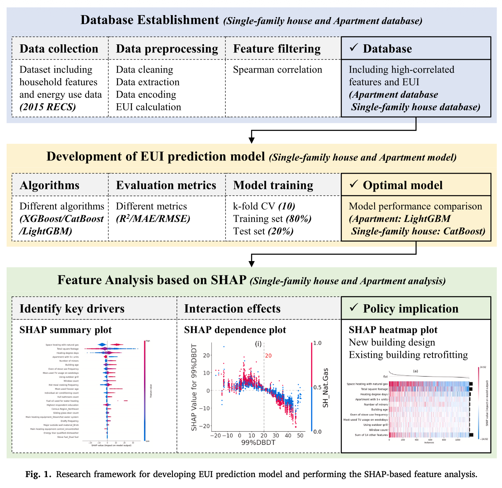

# Energy consumption prediction and household feature analysis for different residential building types using machine learning and SHAP: Toward energy-efficient buildings
Cui, X., Lee, M., Koo, C., & Hong, T. (2024). Energy consumption prediction and household feature analysis for different residential building types using machine learning and SHAP: Toward energy-efficient buildings. *Energy & Buildings*, 309, 113997. https://doi.org/10.1016/j.enbuild.2024.113997

## Summary

This paper builds separate Energy Use Intensity (EUI) prediction models for two US residential building types — apartments and single-family houses — using XGBoost, LightGBM, and CatBoost on the 2015 Residential Energy Consumption Survey (RECS) dataset. After training the models, the study applies SHAP to identify which household features actually drive energy consumption in each type.

Most prior work either focused on specific cities or lumped all building types together. Both choices limit how widely the results apply. This paper uses a national dataset and trains separate models, which turns out to matter.

## Research questions

1. Which tree-based ML model best predicts EUI for apartments and single-family houses?
2. What household features most strongly influence EUI for each building type, and how do they interact?

## Contributions

- Separate, nationally applicable EUI prediction models for US apartments and single-family houses using the full RECS dataset.
- Shows that model performance and feature importance differ meaningfully between building types — separate models are justified, not just convenient.
- Uses SHAP summary plots, dependence plots, and heatmaps to explain what drives consumption in each type.
- Translates findings into energy-saving recommendations for new construction and retrofits.

## Methodology

**Data:**
- Source: 2015 RECS (US Energy Information Administration) — nationally representative household survey
- Apartment database: 1,169 samples, 24 features after filtering
- Single-family house database: 4,231 samples, 18 features after filtering
- Target variable: EUI (kBTU/sqft/year), calculated as total energy use divided by total square footage

**Preprocessing:**
- Missing values: mean imputation for numerical, mode imputation for categorical
- Encoding: one-hot for nominal, ordinal for ordered, binary for binary variables
- Feature filtering: two-step Spearman correlation filter (Cc ≥ 0.1 with EUI; remove lower-correlated feature from pairs with Cc ≥ 0.4 between features)

**Modeling:**
- Algorithms: XGBoost, LightGBM, CatBoost
- Train/test split: 80% / 20%
- Hyperparameter tuning: 10-fold cross-validation on training set
- Evaluation metrics: R², MAE, RMSE

**Interpretability:**
- SHAP applied to the optimal model for each building type
- SHAP summary plot (global feature importance + direction)
- SHAP dependence plot (interaction effects between features)
- SHAP heatmap plot (feature combinations for policy implications)

## Results

**Model performance:**

| Building type | Best model | Test R² | Entire data R² | MAE (kBTU/sqft) | RMSE (kBTU/sqft) |
|---|---|---|---|---|---|
| Apartment | LightGBM | 0.60 | 0.78 | 10.03 | 13.54 |
| Single-family house | CatBoost | 0.58 | 0.71 | 9.42 | 12.92 |

Both beat most comparable models from prior literature, which ranged from R² 0.31 to 0.76.

**Top features — Apartments (SHAP):**
1. Space heating with natural gas (strongest positive driver)
2. Total square footage
3. Heating degree days
4. Apartment with 5+ units (negative effect — larger buildings are more efficient per sqft)
5. Number of minors
6. Building age

**Top features — Single-family houses (SHAP):**
1. Total square footage (strongest driver)
2. Space heating with natural gas
3. 99% dry-bulb design temperature (climate variable)
4. Clothes dryer use frequency
5. Building age
6. Winter night temperature setting

**Key interaction findings:**
- Natural gas space heating significantly increases apartment EUI in cold climates but has little effect in warm areas.
- Larger apartments (>780 sqft) show lower EUI per sqft due to normalization; the same pattern holds for single-family houses (threshold ~1,850 sqft).
- Older buildings have higher EUI in cold climates, and insulation level moderates this in single-family houses.
- Setting winter night temperature below 68°F can save about 6 kBTU/sqft/year in single-family houses.

## Limitations

- Data is from 2015. It may not reflect current building stock or energy behavior.
- The scope is US-only. Whether these patterns hold in other countries — with different building types and climates — is unclear.
- Model performance weakens noticeably for households with very high EUIs (above 160 kBTU/sqft/year for single-family houses).

## Conclusions

LightGBM comes out on top for apartments (R²=0.78 on full data) and CatBoost for single-family houses (R²=0.71). SHAP shows that space heating fuel type, building size, climate, and building age are the main drivers in both types. But the effect sizes and directions differ between building types, which is the whole reason separate models matter.

## Relevance to thesis

The SHAP methodology here is directly useful. The paper shows how to use summary plots, dependence plots, and heatmaps to explain which features drive energy consumption.

The top features also line up well with what's available in Dutch municipal data. Building age and heating type (natural gas vs. other) are in BAG/Kadaster and CBS. Climate indicators like heating degree days come from KNMI. And building size is in CBS housing stock data. So the features that matter here are features I can actually include.

LightGBM and CatBoost outperforming XGBoost is worth noting. My thesis already includes XGBoost and Random Forest, but it might be worth adding LightGBM.

The finding that space heating with natural gas is the single strongest predictor is directly applicable to the Netherlands, where natural gas heating is still the norm for residential buildings.
