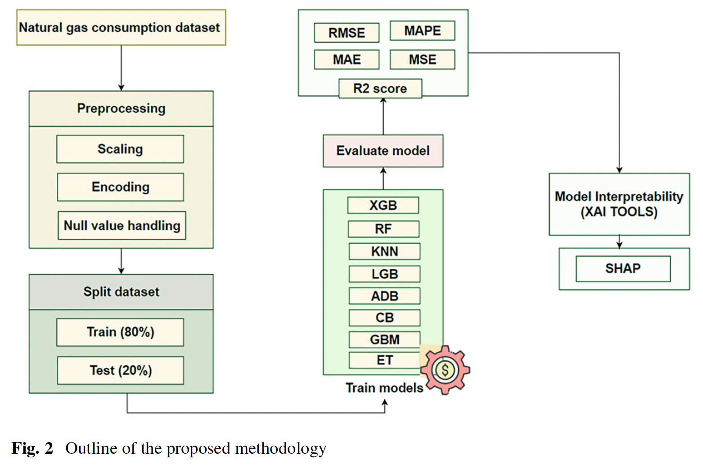

# Explainable AI in Energy Forecasting: Understanding Natural Gas Consumption Through Interpretable Machine Learning Models
Eshita, F. S., Mowla, T. J., & Mahi, A. B. S. (2025). Explainable AI in Energy Forecasting: Understanding Natural Gas Consumption Through Interpretable Machine Learning Models. In Machine Learning Technologies on Energy Economics and Finance: Energy and Sustainable Analytics, Volume 1 (pp. 57-77). Cham: Springer Nature Switzerland.

## Summary
This paper develops a machine learning pipeline for predicting natural gas consumption across US states and sectors, using monthly EIA data from January 2014 to January 2024. Eight models are compared, with CatBoost (CB) emerging as the best performer (R² = 99.81%). SHAP is applied to the best model to explain which features drive predictions.

## Research questions
- Which machine learning model best predicts natural gas consumption?
- How can XAI (specifically SHAP) be used to interpret the model's predictions and identify the most important features?

## Contributions
- Comparative assessment of eight ML models (XGB, RF, KNN, LGB, ADB, CB, GBM, ET) on natural gas consumption forecasting.
- Used SHAP to interpret the best-performing CatBoost model.
- Analysis of US natural gas consumption patterns from 2014 to 2024.

## Methodology

- **Dataset:** Kaggle/EIA dataset — monthly US natural gas consumption by state and sector (automotive fuel, commercial, industrial, residential, electric power), January 2014 – January 2024.
- **Features:** Area code, area name, product, process/sector, series identifier, year, month, units (MMCF).
- **Preprocessing:** Ordinal encoding for categorical features, standardization (zero mean, unit variance), removal of null values and duplicates.
- **Train/test split:** 80/20.
- **Models evaluated:** XGBoost, Random Forest, KNN, LightGBM, AdaBoost, CatBoost, GBM, Extremely Randomized Trees.
- **Evaluation metrics:** MAE, MSE, RMSE, MAPE, R².
- **XAI tool:** SHAP applied to CatBoost; beeswarm and bar plots used to rank feature importance.

## Results
| Model | MAE | RMSE | R² |
|-------|-----|------|----|
| CatBoost (CB) | 1565.15 | 6083.89 | 99.81% |
| ET | 1823.70 | 7838.26 | 99.69% |
| RF | 2445.49 | 8899.69 | 99.6% |
| KNN | 2484.90 | 10891.24 | 99.4% |
| ADB | 3534.15 | 10351.05 | 99.46% |
| LGB | 4622.77 | 12311.56 | 99.24% |
| XGB | 5888.31 | 13539.39 | 99.08% |
| GBM | 11264.31 | 26772.83 | 99.4% |

**SHAP feature importance (CatBoost):** Geographic area (duoarea, area-name) and series identifier are the most influential features. Month also contributes meaningfully (seasonal effect). Year has moderate importance. Units, product, and product-name had near-zero impact.

## Limitations
- Dataset is structured around US state-level aggregate statistics, not individual households or municipalities.
- The features with highest SHAP importance (duoarea, area-name, series) are identifiers rather than causal predictors, so I wonder about whether the model learned meaningful patterns or mostly memorized group-level averages.
- No discussion of cross-validation or risk of overfitting despite very high scores.
- Context is US national data; generalizability to other countries is unclear.

## Conclusions
CatBoost is the best-performing model for predicting natural gas consumption in this dataset (R² = 99.81%). SHAP analysis shows geographic area and series type dominate predictions, while month captures seasonality. The paper demonstrates that XAI tools can make energy forecasting models interpretable and support better energy planning decisions.

## Relevance to thesis
- Confirms that tree-based ensemble models (especially CatBoost, Random Forest, XGBoost) perform well on natural gas consumption prediction tasks.
- SHAP-based interpretability is directly applicable to the thesis for feature importance analysis.
- The seasonal pattern (January peak, May trough) aligns with expected heating degree day effects, which is relevant for the Netherlands context.
