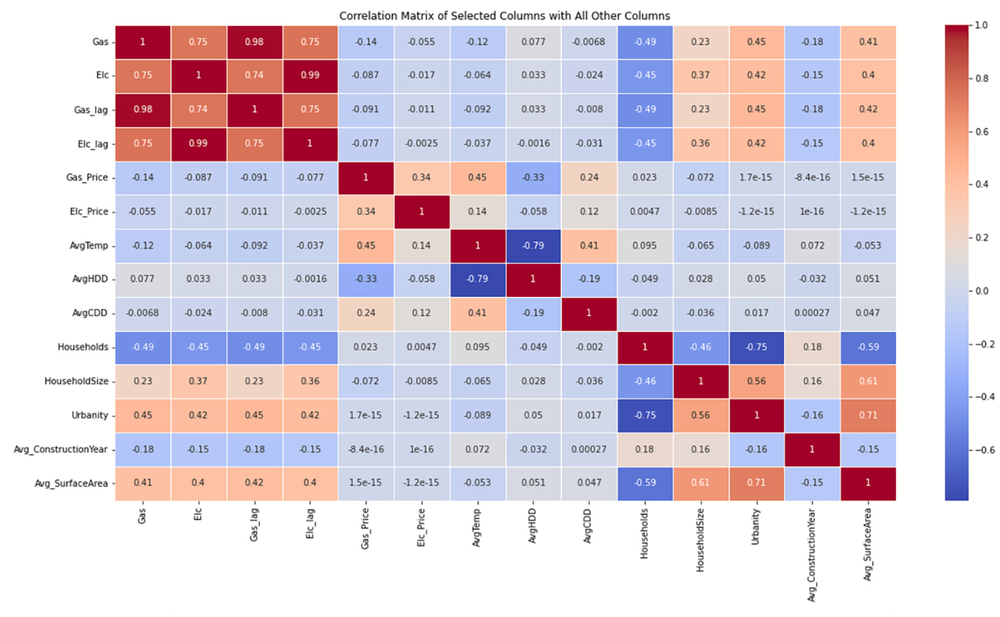

# Machine learning-based localized predictive modeling of household energy consumption in the Netherlands
Jafarigorzin, S., Khalil, F. C., Khalil, L. J., & Kaspard, J. A. (2025). Machine learning-based localized predictive modeling of household energy consumption in the Netherlands. *Energy and Buildings, 348*, 116420. https://doi.org/10.1016/j.enbuild.2025.116420

## Summary

This paper predicts annual residential gas and electricity consumption at the 4-digit postal code level in the Netherlands. It covers 4,053 postal codes from 2013 to 2023, using building, demographic, and climate data. The main finding: building and demographic features matter far more than climate at this level of aggregation. XGBoost with last year's consumption as a lag feature gets around 2% MAE on the 2021 test set.

## Research questions

- Can gas and electricity consumption at postal code level be predicted from temperature, urbanization, household size, building age, and building surface area?
- What is the relative importance of building characteristics, demographic factors, and climate variables in explaining energy consumption?
- Is there a statistically significant inverse relationship between outdoor temperatures and heating energy consumption in the Netherlands?

## Contributions

- Shows that demographic and building features dominate over climate at annual, aggregated level, contradicting the common assumption that weather drives residential gas use
- XGBoost time series model trained on 4-digit postal codes, extended to predict at 6-digit level
- Spatial interpolation of KNMI weather station data to postal codes via IDW

## Methodology

- **Data:**
  - CBS: number of households, household size, homeownership ratio, urbanization level (1–5)
  - BAG (Kadaster): building year, surface area (m²), geographic coordinates
  - KNMI (5 weather stations): temperature, HDD, CDD, interpolated to postal codes via IDW
  - 8 Dutch energy distribution companies: annual gas (m³) and electricity (kWh) per inhabitant at street level
- **Period:** 2013–2023
- **Geographic level:** 4-digit postal codes (~4,053); predictions extended to 6-digit for 2022–2023
- **Preprocessing:** IDW interpolation for weather, outlier removal (surface area >350 m², consumption >25,000 kWh or >10,000 m³ per inhabitant), weighted averages for street-to-postal-code aggregation
- **Models:**
  - Decision Tree (max depth 10), feature importance via Gini impurity
  - XGBoost, three variants: no time series, TS + all variables, TS + building variables only
  - Stratified XGBoost, five separate models, one per urbanization level
- **Split:** Train 2013–2020, Test 2021, Predict 2022–2023
- **Evaluation metrics:** MAE as % of average consumption, MAE as % of standard deviation

## Results

XGBoost TS + Building variables (gas, Table 5):

| Split | MAE % of avg |
|-------|-------------|
| Train 2013–2020 | 2.4% |
| Test 2021 | 2.1% |
| Predict 2022–2023 (6-digit) | 9.7% |

Feature importance (gas, TS + Building variables): Gas_lag1 = 97.1%, Avg_SurfaceArea = 1.3%, Avg_ConstructionYear = 1.0%. Without the lag feature, Households = 39.9%, Avg_SurfaceArea = 19.5%, Avg_ConstructionYear = 14.2%, climate variables <0.4%.

The correlation matrix shows strong auto-correlation (0.98 for gas) and a significant negative correlation between number of households and gas consumption (-0.49). Climate correlations are weak nationally. But 80% of postal codes individually show a significant negative temperature correlation (-0.30 to -0.60), which disappears when aggregated. That's why climate barely registers in the national model.

Stratified XGBoost by urbanization level gave marginal improvement for electricity but not for gas. Urbanity 5 (rural) was hardest to model.

## Limitations

- Annual aggregation hides seasonal effects and weakens the climate signal; the same models would likely show stronger weather sensitivity on monthly data
- Wood pellet heating not included (data unavailable)
- Qualitative factors like behavior and culture are not captured
- The paper trains and tests on 4-digit postal codes but predicts at 6-digit level, which introduces a distribution shift

## Conclusions

Building and demographic features dominate at annual postal code level. Climate matters locally but washes out nationally. XGBoost with a lag feature works well under normal conditions (2.1% MAE on 2021 test). The authors suggest future work should incorporate energy price data and smart meter behavioral data, but leave this fairly vague.

## Relevance to thesis

1. **Lag features are critical** — previous year's consumption absorbs most of the variance; ignoring this leads to much worse models
2. **Demographics and building data beat climate** at annual aggregation; this will likely hold at municipality level too
3. **CBS urbanization levels** are worth using as a stratification variable for error analysis
4. XGBoost TS + Building variables is a strong baseline to replicate or build on
