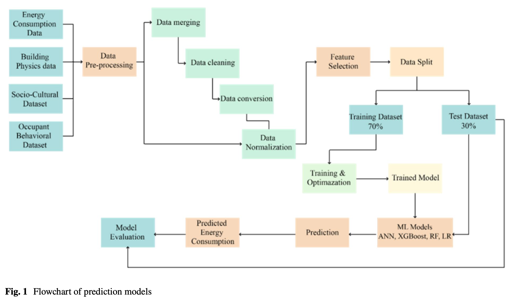

# A comparison between different machine learning techniques for predicting heating energy consumption for residential buildings in a cold climate
Vaisi, S., Ahmadi, N., Shirzadi, A., Bahrami, B., Shahabi, H., & Mahdavinejad, M. (2025). A comparison between different machine learning techniques for predicting heating energy consumption for residential buildings in a cold climate. *Energy Efficiency, 18*(7), 85. https://doi.org/10.1007/s12053-025-10379-1

## Summary

This paper compares LR, RF, ANN, and XGBoost for predicting annual natural gas consumption for space heating and domestic hot water in 525 residential units across Kurdistan province, Iran (2017–2019). What makes it unusual is the dataset: they linked actual utility billing data to two questionnaires covering building physics and occupant behavior, resulting in 89 features from the start. After filtering, 16 high-impact variables went into the models. XGBoost won with R² = 0.90 on the test set. RF was essentially tied, and ANN and LR fell behind.

## Research questions

- Which ML algorithm best predicts annual heating energy consumption in residential buildings in a cold climate?
- How do building physics and occupant behavioral variables compare in terms of predictive importance?
- Can a model trained on multi-year survey data generalize well to unseen buildings?

## Contributions

- Links actual gas billing data to building physics and behavioral survey data via a unique subscriber ID
- Three-stage feature selection pipeline (PCC, VIF, RF+GB importance) that narrows 89 features down to 16
- Shows that occupant behavior (e.g., blocking cooler channels in winter) has measurable predictive value alongside physical building features

## Methodology

- **Data:** 525 residential units in Kurdistan province, Iran; actual gas billing data at 60-day intervals for 2017, 2018, 2019; linked to two surveys (building physics and socio-cultural/behavioral)
- **Features:** Started with 89; reduced to 44 via PCC (|r| > 0.1) and VIF (<5); final 16 selected by average RF + Gradient Boosting importance scores
- **Split:** 70% train, 30% test
- **Models:** Linear Regression, Random Forest (300 trees, max depth 15), ANN (2 hidden layers, 100 neurons, lr 0.01), XGBoost (200 rounds, max depth 6, lr 0.1)
- **Tuning:** Grid search hyperparameter optimization
- **Evaluation metrics:** R², RMSE, MSE, MAE
- **Tools:** Python 3.9.2, Google Colab, scikit-learn

## Results

Test set performance (Table 4):

| Model | R² | RMSE | MSE | MAE |
|-------|----|------|-----|-----|
| XGBoost | 0.90 | 1.61 | 2.61 | 2.00 |
| Random Forest | 0.89 | 1.61 | 2.59 | 1.32 |
| ANN | 0.77 | 2.40 | 5.78 | 1.90 |
| Linear Regression | 0.74 | 2.55 | 6.48 | 1.99 |

XGBoost and RF are almost indistinguishable on RMSE (both 1.61). RF actually has lower MAE (1.32 vs 2.00). ANN underperforms, probably because 525 units is a small dataset for a neural network. LR struggles with the non-linear relationships in the feature mix.

Top 6 features by importance (Table 2):
1. Space heating system type (HVAC)
2. Total unit area (m²)
3. Conditioned unit area (m²)
4. Building age
5. Type of thermal insulation
6. Blocking cooler channels in cold seasons (behavioral)

R² plateaus around 0.90 after just these six variables.

## Limitations

- No explicit weather variables: no HDD, no temperature data. The authors flag this as a gap; weather effects are only implicitly captured through the consumption values
- Small sample: 525 units, single region, cold climate only
- Data from 2017–2019, no time-series analysis, no lag features
- Results are specific to Iranian cold-climate building stock

## Conclusions

XGBoost and RF both reach R² = 0.89–0.90. HVAC type is the single strongest predictor by a wide margin, followed by building size and age. Behavioral variables make it into the top 16, but their individual importance scores are small. The paper makes a reasonable case for including occupant behavior in energy models, but I'm not really sure.

## Relevance to thesis

Useful as confirmation that XGBoost and RF are strong defaults for this type of prediction. And building age and surface area show up here as top predictors, which is consistent with what BAG data provides for Dutch municipalities.
