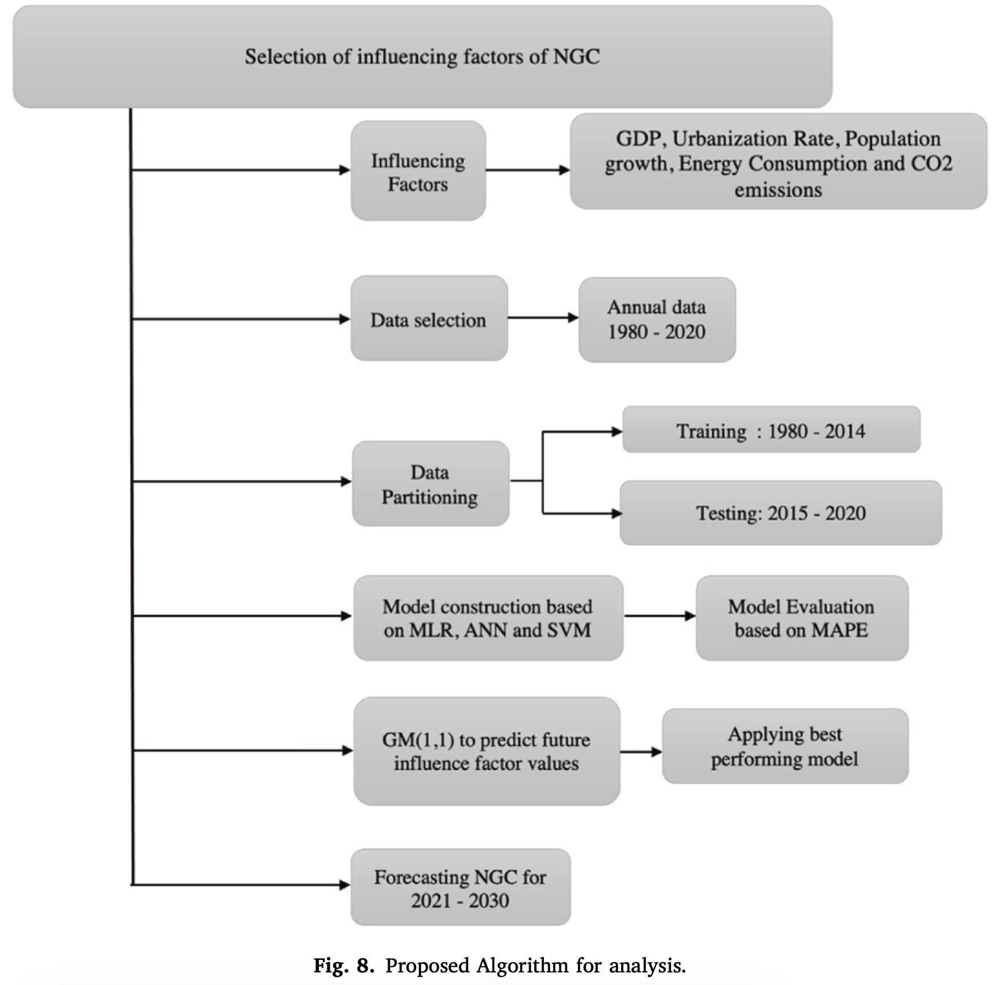

# Forecasting annual natural gas consumption in USA: Application of machine learning techniques — ANN and SVM
Singh, S., Bansal, P., Hosen, M., & Bansal, S. K. (2023). Forecasting annual natural gas consumption in USA: Application of machine learning techniques-ANN and SVM. *Resources Policy, 80*, 103159. https://doi.org/10.1016/j.resourpol.2022.103159

## Summary

This paper predicts annual natural gas consumption (NGC) in the USA using three models: Multiple Linear Regression (MLR), Artificial Neural Network (ANN), and Support Vector Machine regression (SVM). The data covers 1980–2020 at the national level, 41 annual observations in total. Train/test split is 1980–2014 for training and 2015–2020 for testing. The best-performing model is then used to forecast NGC from 2021 to 2030, with future feature values projected using a Grey model GM(1,1).

Features are only macro-level: GDP per capita, total population, urban population share, primary energy consumption, and CO2 emissions. No weather data, no housing characteristics, no spatial variation. Just five national-level indicators across four decades.

All three models achieve MAPE below 5% on both training and test sets. SVM has the lowest test MAPE (2.7%), but ANN was chosen for the 2021–2030 forecast anyway, based on having the lowest training MAPE. That choice is interesting, and the authors don't really justify it which I don't really get. The forecast shows NGC declining from about 31,400 bcf in 2021 to about 27,360 bcf by 2030.

## Research questions

- Which of MLR, ANN, and SVM best predicts annual natural gas consumption in the USA using socioeconomic indicators?
- Which socioeconomic factors have the strongest correlation with NGC?
- How is NGC expected to change from 2021 to 2030 given projected trends in the influence factors?

## Contributions

- Comparison of MLR, ANN, and SVM for annual NGC forecasting using national US data
- Identification of GDP and population as the strongest predictors of NGC (r=0.92 each), with urbanization rate close at 0.91
- 10-year NGC forecast (2021–2030) using GM(1,1) to project future feature values before feeding them into the selected model

## Methodology

- **Target variable:** Annual natural gas consumption in billion cubic feet (bcf), sourced from EIA
- **Features (5):** GDP per capita (constant 2015 USD), total population, urban population (% of total), primary energy consumption (TWh), CO2 emissions
- **Data sources:** EIA, World Bank, OurWorldInData
- **Period:** 1980–2020 (n=41); training 1980–2014, testing 2015–2020
- **Cross-validation:** 7-fold
- **MLR:** Standard OLS; equation: NGC = -7.157 - 1.123·GDP + 1.346·P + 4.299·UR + 3.394·EC - 2.193·CO2
- **SVM:** Linear kernel, cost=1.0, gamma=0.2, ε=0.1; outperformed polynomial, sigmoid, and radial kernels
- **ANN:** MLP with 1 hidden layer and 1 node, logistic activation; node count selected by minimizing training MAPE across 1–5 nodes
- **Future projection:** Grey model GM(1,1) projects feature values for 2021–2030, then fed into ANN
- **Evaluation metrics:** MAPE and RMSE

## Results

| Model | Train MAPE | Test MAPE | Test RMSE |
|-------|-----------|-----------|-----------|
| MLR | 0.023 | 0.037 | 1217.73 |
| ANN | 0.022 | 0.030 | 1137.19 |
| SVM | 0.030 | 0.027 | 903.95 |

All three are well within the "excellent fit" threshold of MAPE < 10%. SVM comes out on top by both test metrics (MAPE 2.7%, RMSE 903.95). ANN is second on test MAPE. MLR is worst.

But ANN was selected for the 2021–2030 forecast because it had the lowest training MAPE. The paper doesn't explain why training performance should override test performance when choosing a forecast model.

Feature correlations with NGC:

| Variable | r |
|----------|---|
| GDP per capita | 0.92 |
| Total population | 0.92 |
| Urban population % | 0.91 |
| Primary energy consumption | 0.74 |
| CO2 emissions | 0.36 |

The 2030 forecast projects NGC dropping to about 27,360 bcf, down from ~31,400 in 2021. The main drivers in the projection are declining primary energy consumption (-0.67%/year) and falling CO2 emissions (-2%/year), with GDP and population still growing.

## Limitations

- Very small dataset (n=41 annual observations); too few points for reliable ML training, especially ANN
- Grey model GM(1,1) is designed for small uncertain datasets and is not well suited for projecting decades ahead
- National aggregation only; no regional, state-level, or municipal variation captured
- Missing factors: weather (heating degree days), housing stock age, energy efficiency policy, building insulation

## Conclusions

SVM with a linear kernel performs best on the test set, beating both ANN and MLR on MAPE and RMSE. But the authors pick ANN for the 10-year forecast anyway. On feature importance, GDP and population are the clear front-runners at r=0.92 each. CO2 emissions is a weak predictor by comparison (0.36), and probably not useful on its own.

The 10-year forecast projects a gradual decline in US gas consumption, consistent with EIA projections about a shift toward renewables.

## Relevance to thesis

GDP and population are strong predictors of gas consumption at the national level in the USA, which supports using similar variables (income, household size, urbanization degree) at the municipal level in the Netherlands.
