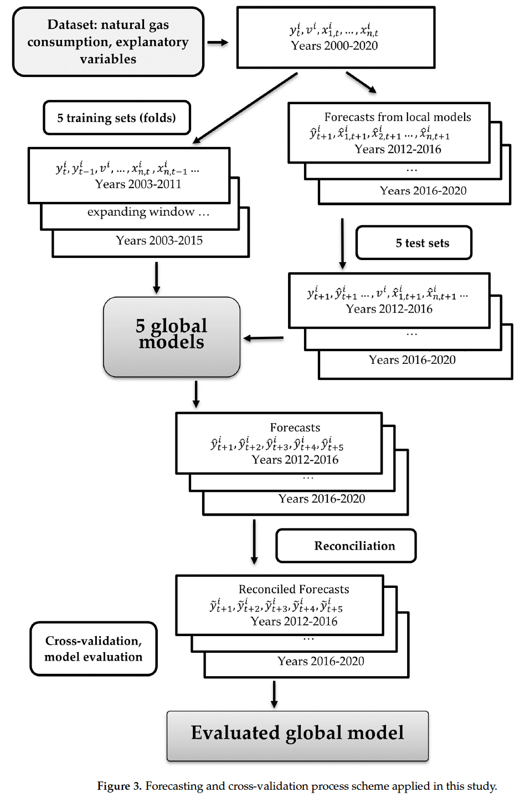

# Global and Local Approaches for Forecasting of Long-Term Natural Gas Consumption in Poland Based on Hierarchical Short Time Series
Gaweł, B., & Paliński, A. (2024). Global and local approaches for forecasting of long-term natural gas consumption in Poland based on hierarchical short time series. *Energies, 17*(2), 347. https://doi.org/10.3390/en17020347

## Summary

This paper forecasts household natural gas consumption in Poland across a four-level territorial hierarchy: country, province (voivodeship), county (poviat), and municipality (commune). The data runs from 2000 to 2020, giving a maximum of 20 yearly observations per series. The central question is whether global (cross-learning) ML models trained on all series at once can outperform local statistical models fitted series-by-series.

The data covers 1851 municipalities, 341 counties, 16 provinces, and 1 national total, roughly 46,000 observations in total. Features were narrowed down to population, households with gas access, and number of dwellings after a selection step. Province code is also added as a one-hot encoded variable in the multivariate models to give some geographic context.

Global ML models beat local statistical models by 6–9 percentage points in MAPE. MLP with multivariate inputs (MLP Global ex) comes out on top at 7.1%. Local ETS with Min-T reconciliation, the best local approach, only manages 15.4%. And linear regression and panel data models came in above 30% MAPE.

## Research questions

- Do global (cross-learning) ML models outperform local statistical models for hierarchical short time series of gas consumption?
- Does adding explanatory variables (population, dwellings, households with gas access) improve forecast accuracy over univariate global models?
- Does the choice of ML model (MLP, LSTM, LightGBM) matter, and is LSTM worth its computational cost for short series?

## Contributions

- First study to compare global vs local forecasting approaches for hierarchical household gas consumption data with very short series (max 20 observations)
- Demonstration that MLP with multivariate inputs outperforms both local statistical methods and LSTM at lower computational cost
- Detailed performance breakdown by hierarchy level, showing that errors increase going from country down to municipality
- Finding that linear regression is inadequate for this task (MAPE > 30%), likely due to nonlinear relationships between the explanatory variables and consumption

## Methodology

- **Data source:** Polish Central Statistical Office (GUS Local Data Bank)
- **Hierarchy:** 1 country, 16 provinces, 341 counties, 1851 municipalities; total ~46,297 observations
- **Period:** 2000–2020, yearly, max 20 observations per series
- **Target:** Household natural gas consumption [MWh]
- **Features selected:** population, number of households with gas access, number of dwellings; province code (one-hot encoded) added in multivariate models; lagged gas consumption (up to 3 lags) used in all global models
- **Local models (series-by-series):** NAÏVE (benchmark), 3MA, auto-ARIMA, auto-ETS
- **Global univariate ML:** MLP, LSTM, LightGBM (lagged consumption as features only)
- **Global multivariate ML:** MLP, LSTM, LightGBM (lagged consumption + explanatory variables + province code)
- **Reconciliation strategies tested:** top-down, bottom-up, middle-out, Min-T; middle-out performed best for global models, Min-T for local ETS
- **Cross-validation:** rolling-origin with 5 folds spanning 2012–2016 (expanding window)
- **Forecast horizon:** h = 5 years
- **Evaluation metrics:** MAPE and RMSE; Nemenyi test used for statistical significance

## Results

Local models (ETS with Min-T reconciliation, best local approach):

| Metric | Value |
|--------|-------|
| MAPE | 15.4% |
| RMSE | 9368 |

Global models (reconciled with middle-out):

| Method | Approach | MAPE [%] | RMSE |
|---|---|---|---|
| LightGBM Global | Global univariate | 9.8 | 7729 |
| MLP Global | Global univariate | 9.2 | 7264 |
| LSTM Global | Global univariate | 8.5 | 5476 |
| LightGBM Global ex | Global multivariate | 9.2 | 7189 |
| LSTM Global ex | Global multivariate | 7.8 | 5478 |
| **MLP Global ex** | **Global multivariate** | **7.1** | **4970** |

MLP Global ex is best overall. Adding explanatory variables improves MAPE by about 1 percentage point over the univariate global approach. Switching from local to global saves about 8 percentage points. The gap between global and local is the big finding here; the gap between univariate and multivariate global is comparatively modest.

By hierarchy level (MLP Global ex):

| Level | MAPE [%] | RMSE |
|---|---|---|
| Country | 3.3 | 1,971,673 |
| Province | 4.0 | 147,538 |
| County | 5.6 | 9192 |
| Commune | 7.3 | 1897 |

Errors increase going down the hierarchy, as commune-level series are noisier. LightGBM shows the lowest variance across folds, which makes it consistent, but MLP is more accurate. LSTM takes 0.80h to train vs MLP's 0.40h and doesn't reliably outperform it on short series.

## Limitations

- Standard off-the-shelf ML algorithms used without customization; ensemble methods or adapted architectures might do better
- Municipalities with fewer than 15 years of gas network coverage were excluded, missing the most rapidly developing areas
- Forecast accuracy at commune level (7.3% MAPE) may not be good enough for operational planning
- No spatial autocorrelation is explicitly modeled; provinces are treated as independent via one-hot encoding
- Data ends in 2020; energy behavior shifts from 2021 onward (Ukraine war, gas price spikes) are not reflected

## Conclusions

MLP is the practical choice for this type of problem. It roughly matches LSTM on accuracy and trains in half the time. LightGBM offers more consistent results across folds, which matters if you want predictable forecasts, but it's not the most accurate option overall.

Linear regression doesn't work here. MAPE above 30% is evidence that the relationship between population, dwelling counts, and gas consumption is nonlinear in ways that a linear model can't pick up.

Poland's gas consumption patterns turn out to be more similar across provinces than you'd expect given the country's regional diversity. The global model picks this up without any explicit spatial modeling, which suggests territorial grouping may matter less than the sheer volume of training data available when you pool everything together.

## Relevance to thesis

High. This is the closest structural match to my thesis among all papers reviewed so far. It predicts residential gas consumption at the municipality level using yearly data — same target variable, same geographic unit, same time frequency. The data source is a national statistics office (GUS for Poland, CBS for the Netherlands), the features overlap well, and the performance at commune level (7.3% MASE) gives a concrete benchmark to compare against.

Several findings carry over directly. The global/cross-learning approach is recommended when individual time series are short, which applies to Dutch municipalities too. The feature set (population, households with gas access, dwellings) maps closely to what CBS makes available. And the finding that linear regression produces MAPE above 30% is useful evidence that ML models are worth the extra complexity.

But there are real differences. The Dutch dataset has ~340 municipalities vs 1851 Polish communes, so the cross-learning benefit will probably be smaller. This paper doesn't test Random Forest or XGBoost at all. Weather variables and building age are also absent, which I expect to matter more at the Dutch municipal level than the Polish demographic features alone.
